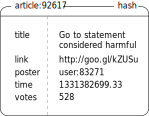
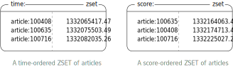
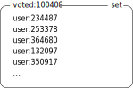

## Voting on articles

An example article stored as a HASH for our article voting system:

We can see a small example of time- and score- ordered article ZSETs, these two sorted sets representing time-ordered and score-ordered article indexes:

Some users who have voted for article 100408:

